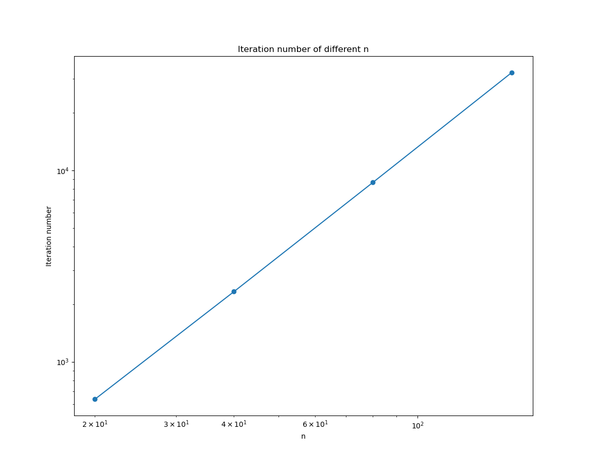
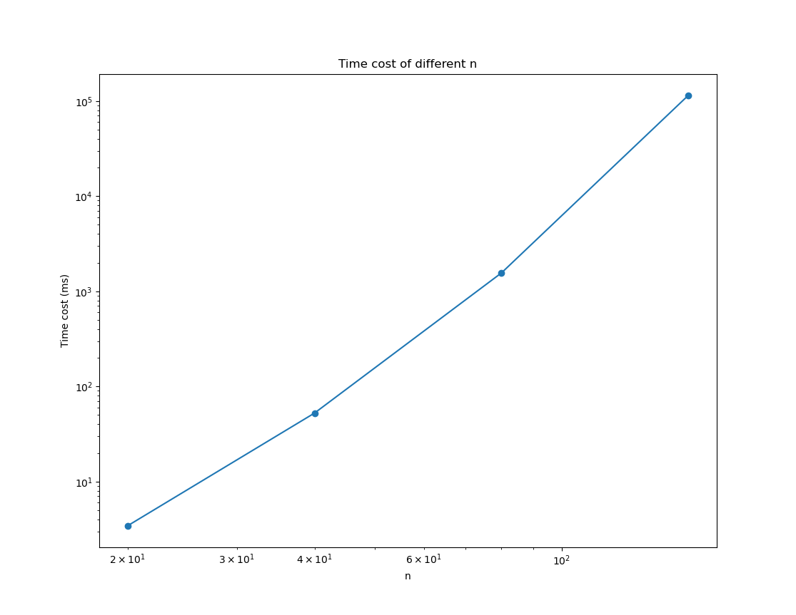
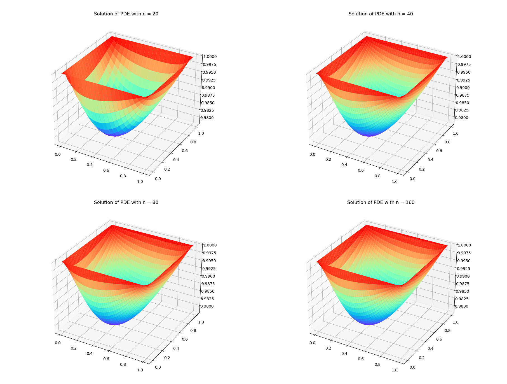

# 数值代数第 4 次上机作业报告

> 陈润璘 2200010848

## 问题描述

在本次作业中，我们使用 Gauss-Seidel 迭代法求解线性方程组。

#### 偏微分方程的求解

首先，我们考虑一个 $[0,1]\times[0,1]$ 中偏微分方程 $-\Delta u+g(x,y)u =f(x,y)$，边界条件为 $u = 1$。同时在 $x$ 和 $y$ 方向进行离散，可以得到一个线性方程组 
$$
-u_{i-1,j}-u_{i,j-1}-u_{i+1,j}-u_{i,j1}+(4+h^2g(ih,jh))u_{i,j} = h^2f(ih,jh)
$$
其中 $h = 1/N$，$N$ 为网格数。

这是一个 $N$ 对角的线性方程组，我们可以使用带状 Gauss-Seidel 迭代法求解。

#### 一个几乎奇异的线性方程组

接下来，我们考虑一个几乎奇异的线性方程组

$$
Ax = b
$$

其中

$$
A = \begin{pmatrix}
1 & -1 & 0 \\
-1 & 2 & -1 \\
0 & -1 & 1 \\
\end{pmatrix} + \epsilon I, \quad b = \begin{pmatrix}
1 \\
10 \\
23 \\
\end{pmatrix}
$$

我们对于不同的 $\epsilon$ 使用 Gauss-Seidel 迭代法求解，观察迭代次数的变化，并改进算法以减少迭代次数。

## 数值方法

#### 带状 Gauss-Seidel 迭代法

对于带状线性方程组 $Ax = b$，我们可以使用 Gauss-Seidel 迭代法求解，但是由于矩阵中存在很多零元素，我们可以使用带状存储方式，减少存储空间和计算量。由于此次作业中的矩阵规模较大，我们使用 C++ 实现了带状 Gauss-Seidel 迭代法并求解偏微分方程。

#### 改进的 Gauss-Seidel 迭代法

对于本次作业中的几乎奇异的矩阵，如果直接使用 Gauss-Seidel 迭代法，当 $\epsilon$ 较小时，迭代次数会非常多。观察迭代过程，可以发现在每一次近似求解残量方程 $Ae_0=r_0$ 时由于 $A$ 有一个特征值为 $\epsilon$，导致每一次近似求解时在该方向上的误差较大，从而导致更多的迭代次数。

为了解决这一问题，我们可以在每一次求解残量方程 $Ae_0=r_0$ 时将 $r_0$ 分解为垂直于 $[1,1,1]^T$ 的方向和平行于 $[1,1,1]^T$ 的方向，在平行于 $[1,1,1]^T$ 的方向上直接精确求解，垂直于 $[1,1,1]^T$ 的方向上使用近似逆求解。由于 $A$ 只有一个于 $\epsilon$ 相关的特征值 $\epsilon$，其特征向量 $v = [1,1,1]^T$，$Av = [\epsilon, \epsilon, \epsilon]^T$，从而垂直于 $[1,1,1]^T$ 方向上的迭代次数与 $\epsilon$ 无关，而平行于 $[1,1,1]^T$ 方向上残量可以直接求解，故总的迭代次数与 $\epsilon$ 无关。

## 数值结果

#### 偏微分方程的求解

对于偏微分方程 $-\Delta u+g(x,y)u =f(x,y)$，其中 $g(x,y)=\exp(xy)$，$f(x,y)=x+y$，我们分别取网格数 $N=20,40,80,160$，使用带状 Gauss-Seidel 迭代法求解，记录 CPU 时间和迭代次数，结果如下表所示。

| $N$ | 迭代次数 | CPU 时间 |
| :---: | :---: | :---: |
| 20 | 637 | 3.42548ms |
| 40 | 2323 | 52.442ms |
| 80 | 8642 | 1559.4ms |
| 160 | 32448 | 114860ms |

画出迭代次数、CPU 时间与网格数的图像如下：

可以看出，迭代次数和 CPU 时间均随网格数指数增长。

画出不同网格数下的解的图像如下：

#### 一个几乎奇异的线性方程组

对于几乎奇异的线性方程组 $Ax = b$，我们取 $\epsilon = 10^{-k}$，$k=0,1,2,3,4,5，6,7$，使用 Gauss-Seidel 迭代法求解，当 $\frac{\|Ax-b\|_2}{\|b\|_2}\le 1e-7$ 时停止迭代，记录迭代次数，结果如下表所示。

| $\epsilon$ | 迭代次数 | 解 |
| :---: | :---: | :---: |
| $10^0$ | 16 |[ 5.99999922 10.99999948 16.99999974]|
| $10^{-1}$ | 113 |[103.54837602 112.90321526 123.54837751]|
| $10^{-2}$ | 1077 |[1122.66360965 1132.89024752 1144.44578963]|
| $10^{-3}$ | 10722 |[11322.56528707 11332.88785413 11344.54331082]| 
| $10^{-4}$ | 107172 | [113322.54481531 113332.87707157 113344.54261731]|
| $10^{-5}$ | 1071680 |[1133322.43734164 1133332.77056779 1133344.43712342]|
| $10^{-6}$ | 10716595 |[11333321.37204934 11333331.70537248 11333343.37202911]|
| $10^{-7}$ | 107152613 |[1.13333311e+08 1.13333321e+08 1.13333333e+08]|

可以看出，当 $\epsilon$ 接近 0 时，迭代次数急剧增加。

如果使用改进后的 Gauss-Seidel 迭代法，迭代次数与 $\epsilon$ 的关系如下表所示。

| $\epsilon$ | 迭代次数 | 解 |
| :---: | :---: | :---: |
| $10^0$ | 10 |[ 6.00000018 11.00000024 17.00000012]|
| $10^{-1}$ | 8 |[103.54839048 112.90322825 123.54838932]|
| $10^{-2}$ | 6 |[1122.66372313 1132.89036053 1144.44590151]|
| $10^{-3}$ | 4 |[11322.56679325 11332.88935911 11344.54481429]|
| $10^{-4}$ | 4 |[113322.55668032 113332.88893598 113344.55448053]|
| $10^{-5}$ | 4 |[1133322.55565279 1133332.88887835 1133344.55543279]|
| $10^{-6}$ | 3 |[11333322.55563406 11333332.88895759 11333344.55561303]|
| $10^{-7}$ | 2 |[1.13333321e+08 1.13333331e+08 1.13333343e+08]|

在使用改进的方法求解时，迭代此时并没有随 $\epsilon$ 的减小而增加，而是保持在一个较小的值。