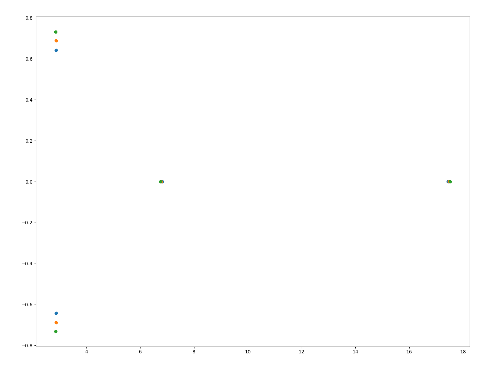

# 数值代数第 6 次上机作业报告

> 陈润璘 2200010848

## 问题描述

求一个矩阵的特征值和特征向量是一个常见的问题，通常使用迭代法求解。本次作业实现了幂法和隐式 QR 方法，求解一个给定矩阵的最大特征值(幂法)或全部特征值(隐式 QR 方法)。

在本次作业中，我们首先计算一个通过将一个方程化为一个矩阵的特征值问题来计算这个方程的模最大的根。然后，我们使用隐式 QR 方法求解以下矩阵的全部特征值：

$$
A = \begin{pmatrix}
9.1 & 3.0 & 2.6 & 4.0 \\
4.2 & 5.3 & 4.7 & 1.6 \\
3.2 & 1.7 & 9.4 & x \\
6.1 & 4.9 & 3.5 & 6.2
\end{pmatrix}
$$

其中 $x=0.9,1.0,1.1$。

## 数值方法

### 幂法

幂法是求解矩阵最大特征值的一种迭代方法。其基本思想是，若一个矩阵 $A$ 的最大特征值为 $\lambda_1$ 与其它特征值分离，那么对于任意一个非零向量 $x$，有

$$
\lim_{k \to \infty} \frac{A^k x}{\|A^k x\|} = \lambda_1 v
$$

其中 $v$ 是 $\lambda_1$ 对应的特征向量。因此，我们可以通过迭代计算 $u_k = A x_{k-1}$，在将 $u_k$ 归一化得到 $x_k$，最终得到 $\lambda_1$。

### 隐式 QR 方法

隐式 QR 方法是求解矩阵全部特征值的一种迭代方法，其对双重步位移 QR 方法进行了改进。双重步位移 QR 方法是通过两次带位移的 QR 分解来加速 QR 方法的收敛，但是可能会在计算过程中出现复数，导致计算变得复杂。隐式 QR 方法通过将双重步位移 QR 方法中的一次迭代改为进行一次上 Hessenberg 化，从而避免了复数的出现。

此外，隐式 QR 方法还会在每一次迭代后判断是否分离出一个特征值或一对共轭特征值，此后只需对剩余的矩阵进行迭代即可。

## 数值结果

### 幂法

使用幂法求解方程 $f(x) = x^8 + 101x^7 + 208.01x^6 + 10891.01x^5 + 9802.08x^4 + 79108.9x^3 - 99902x^2 + 790x - 1000$ 的最大特征值。我们使用 $x_0 = (1, 1, 1, 1, 1, 1, 1, 1)$ 作为初始向量，迭代 100 次，得到这个方程的模最大的根为 $-100.0$，带入方程得到 $f(-100.0) = -0.00218$。

### 隐式 QR 方法

使用隐式 QR 方法求解前述矩阵 $A$ 的全部特征值，得到如下结果：

- 当 $x=0.9$ 时，特征值为 $[17.43967819,\, 2.87040174+0.64289113i,\, 2.87040174-0.64289113i,\, 6.81951834]$；
- 当 $x=1.0$ 时，特征值为 $[17.47648492,\, 2.86799925+0.68874736i,\, 2.86799925-0.68874736i,\, 6.78751659]$；
- 当 $x=1.1$ 时，特征值为 $[17.51302807,\, 2.86545787+0.73216974j,\, 2.86545787-0.73216974j,\, 6.75605619]$。

其中，对于每个 $x$，迭代次数都为 6 次。

将不同的 $x$ 对应的特征值绘制在复平面上，得到如下图像：

由上图可以看出，对于取值相近的 $x$，特征值的分布也相近，由此可以得出这个问题是良态的。